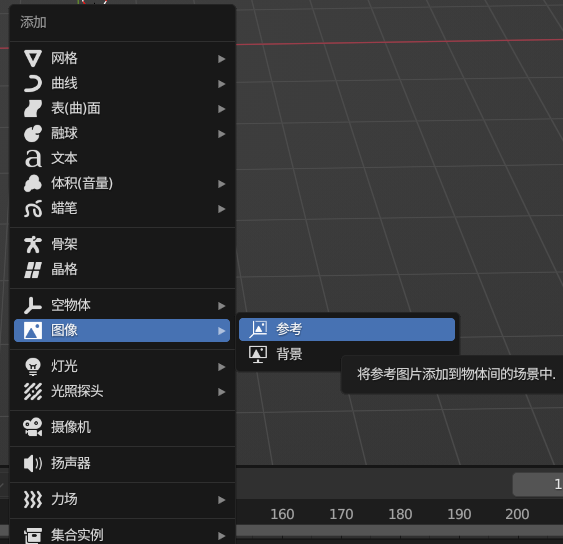
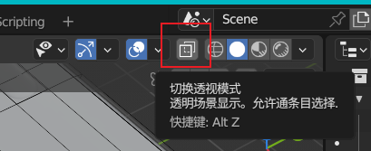
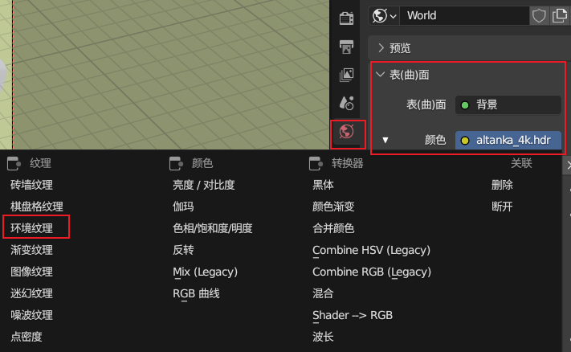

组合键：指令键+轴向键，例如沿z轴移动`G Z`、沿y轴旋转`R Y`、沿x轴缩放`S X`

# 快捷键

| 快捷键               | 作用                  | 快捷键        |              |
| -------------------- | --------------------- | ------------- | ------------ |
| `G`（Geographic）    | 移动对象              | `X`（X axis） | X轴          |
| `R`（Rotate）        | 旋转对象              | `Y`（Y axis） | Y轴          |
| `S`（Scale）         | 缩放对象              | `Z`（Z axis） | Z轴          |
| `1`                  | 点                    | `alt+左键`    | 旋转视角     |
| `2`                  | 线                    | 空格          | 移动视角     |
| `3`                  | 面                    | 滚轮          | 缩放视角     |
| `小键盘1`            | 正视图                | `SHIFT A`     | 呼出添加列表 |
| `小键盘3`            | 右视图                | `I`           | 内插面       |
| `小键盘7`            | 顶视图                |               |              |
| `小键盘2`            | 透视视图              |               |              |
| `tab`                | 切换编辑模式/物体模式 |               |              |
| `E`                  | 挤出                  |               |              |
| `CTRL+B`             | 倒角(切圆角)          |               |              |
| `F`                  | 封口                  |               |              |
| `SHIFT D`            | 复制                  |               |              |
| `SHIFT J`            | 合并                  |               |              |
| `SHIFT+ALT+鼠标左键` | 选择循环边            |               |              |
| `CTRL+R`             | 添加循环边            |               |              |
|                      |                       |               |              |
|                      |                       |               |              |
|                      |                       |               |              |

# 添加参考图

`shift + A`  > 图像 > 参考

# 透视模式

# 添加HDR环境贴图

世界属性 > 表(曲)面 > 颜色 > 环境纹理

