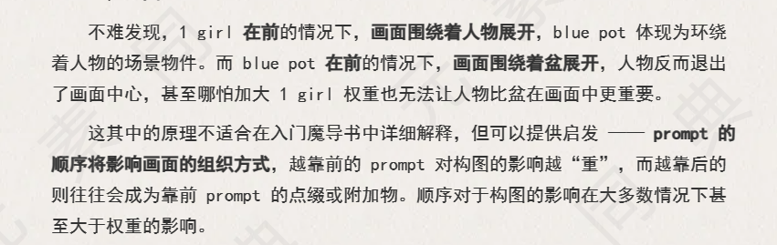
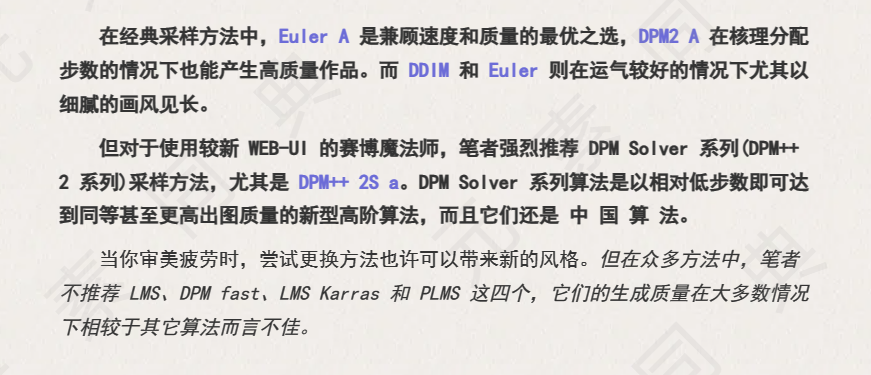
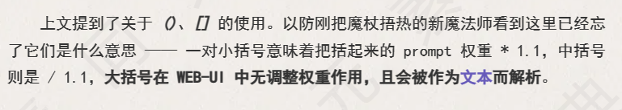
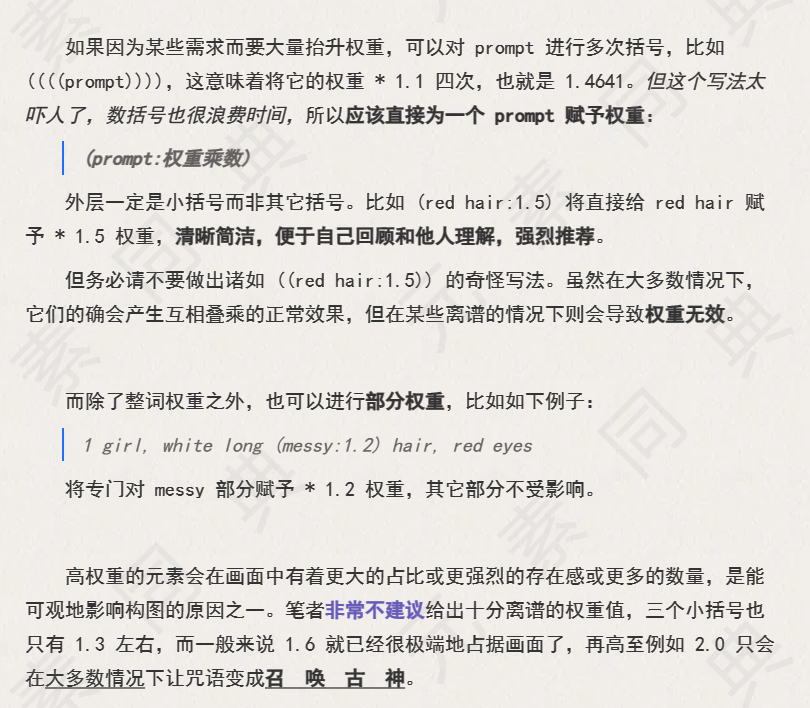

StableDiffusion 中文名稳定扩散算法，缩写SD

自训练微调方法：text inversion 、hypernetwork、dreambooth、native training、DreamArtist、Lora

vae-变分自编码器,clip-文本编码器

ckpt格式(即webui适用的格式)

后来又推出了safetensors 格式,***旨在取代前面介绍的格式\*** ，使用方法上与ckpt格式类似,也是下载到webui的model文件夹下即可(如果webUI加载不出safetensors格式模型,可能是webui版本过旧,请gitpull更新)，比ckpy格**式加载速度更快更安全**


提示词 -> 文本分析编码 -> 模型 -> 生成图片

同样的提示词，在不同风格的模型下，会产出不一样的图片


反向提示词：不想出现的内容、例如畸形四肢等


# 提示词

正向提示词和反向提示词

正向提示词是希望出现的东西，反向提示词是不希望出现的东西，例如色情内容、畸形四肢等

## 提示词语法

((())) 三个小括号用以强调


Sampling steps 步数，步数越高效果越高，时间越长，且you

采样方法(Sampler)，选DPM++ SDE Karras

勾选面部修复


1. 通用Tag起手式：

正向：

masterpiece, best quality, 更多画质词，画面描述

反向：

nsfw, lowres, bad anatomy, bad hands, text, error, missing fingers,extra digit, fewer digits, cropped, worst quality, low quality, normal quality, jpeg artifacts, signature, watermark, username, blurry,根据画面产出加不想出现的画面。nsfw（not safe for work＝涩图）


2. 越靠前的Tag权重越大；比如景色Tag在前，人物就会小，相反的人物会变大或半身。


3. 生成图片的大小会影响Prompt的效果，图片越大需要的Prompt越多，不然Prompt会相互污染。


4. 在Stable Diffusion 中使用()英文括号可增加括号中Tag在画面中的权重 x1.1，[]可减小Tag权重x0.91。在NovelAi官网中，使用{}增加权重x1.05。


5. Prompt支持使用emoji，且表现力较好，可通过添加emoji达到表现效果。如😍形容表情，🖐可修手。 作者：小白随心所欲 https://www.bilibili.com/read/cv19693040/ 出处：bilibili

Prompt格式优化：

1. 简易换行三段式表达：

第一段： 画质tag，画风tag

第二段：画面主体，主体强调，主体细节概括。（主体可以是人、事、物、景）画面核心内容

第三段：画面场景细节，或人物细节，embedding tag。画面细节内容

第二段一般提供人数，人物主要特征，主要动作（一般置于人物之前），物体主要特征，主景或景色框架等


2.元素同典调整版语法：

质量词→前置画风→前置镜头效果→前置光照效果→（带描述的人或物AND人或物的次要描述AND镜头效果和光照）*系数→全局光照效果→全局镜头效果→画风滤镜（embedding） 

Tips: 不同模型（ckpt）对Prompt的敏感程度不同，一套完善的prompt在不同的模型中，表达效果会有差异。每个模型都有自己的特色，需根据模型特色，慢慢调试prompt组合。 作者：小白随心所欲 https://www.bilibili.com/read/cv19693040/ 出处：bilibili




# hires.fix 高清修复

勾选Hires.fix 使面部更精细，Hires steps 10-25，越高脸越精细，重绘幅度0.5-0.7

放大算法，选Latent(bicubic antialiased)

重绘幅度设置0，仅放大画面，不改变内容


# 采样方法Sampling Method

采样方法组成了图片生成的第一大要素，他决定同样的prompt下AI会选择以何种方式去噪点化已得到最终图片。同时，他还会决定运算速度。




# 权重






# 通用负面词条

```
nsfw,(mutated hands and fingers:1.5 ),(mutation, poorly drawn :1.2), (long body :1.3), (mutation, poorly drawn :1.2),(breasts:1.4), liquid body, text font ui, long neck, uncoordinated body,fused ears,huge,ugly,[:(one hand with more than 5 fingers, one hand with less than 5 fingers):0.8],(((simple background))),monochrome ,lowres, bad anatomy, bad hands, text, error, missing fingers, extra digit, fewer digits, cropped, worst quality, low quality, normal quality, jpeg artifacts, signature, watermark, username, blurry, lowres, bad anatomy, bad hands, text, error, extra digit, fewer digits, cropped, worst quality, low quality, normal quality, jpeg artifacts, signature, watermark, username, blurry, ugly,pregnant,vore,duplicate,morbid,mut ilated,tran nsexual, hermaphrodite,long neck,mutated hands,poorly drawn hands,poorly drawn face,mutation,deformed,blurry,bad anatomy,bad proportions,malformed limbs,extra limbs,cloned face,disfigured,gross proportions, (((missing arms))),(((missing legs))), (((extra arms))),(((extra legs))),pubic hair, plump,bad legs,error legs,username,blurry,bad feet,negative, 
```


1.1 绪论

不同的模型会带来不同的画风、认识不同的概念（人物/物体/动作），这是模型众多的原因。

常说的 NovelAI 就是特指 NovelAI 制作的一款 日系二次元特化 的模型。

而 stable-diffusion 1.5 2.0 这些模型是较为通用的、现实模型，无法画出二次元图片

1.2 模型概况

当前，常见的模型可以分为两大类：

- 大模型
- 小型模型（用于微调大模型）

 这里的大模型特指标准的 latent-diffusion 模型。拥有完整的 TextEncoder、U-Net、VAE。

由于想要炼制、微调（finetune）大模型十分困难，需要好显卡、算力，所以更多的人选择去炼制小型模型。这些小型模型通过作用在大模型的不同部分，来简单的修改大模型，从而达到目的。

常见的用于微调大模型的小型模型又分为以下几种：

- Textual inversion (常说的Embedding模型)、
- Hypernetwork模型、
- LoRA模型。

此外，还有一种叫做 VAE 的模型，通常来讲 VAE 可以看做是类似滤镜一样的东西[3]。他会影响出图的画面的色彩和某些极其微小的细节。大模型本身里面就自带 VAE 的，但是一些融合模型的 VAE 烂掉了 （典型：Anything-v3），需要外置 VAE 的覆盖来救救。有时画面发灰就是因为这个原因。

[3] VAE,  Variational autoencoder。变分自编码器，负责将潜空间的数据转换为正常图像。

由于模型的种类不同、作用位置也不同，所以想要使用这些模型文件必须分清这些模型类别，并且正确的使用对应的方法模型才会生效。


2.1 模型后缀名之谜

目前，常见的 AI绘画 用模型后缀名有如下几种：

1. ckpt ，2. pt ，3. pth，4. safetensors，5（特殊）webui 特殊模型保存方法：PNG、WEBP图片格式。

暂且抛开第五种不谈。这几种后缀名都是标准的模型，从后缀名是无法判断具体是哪一种类的模型。

其中，1,2,3 这三种是 pytorch[2] 的标准模型保存格式，由于使用了 Pickle，会有一定的安全风险（自行百度：pickle反序列化攻击）。第四种为一种新型的模型格式，正如同他的名字，safe。为了解决前面的这几种模型的安全风险而出现的。safetensors 格式与 pytorch 的模型可以通过工具进行任意转换，只是保存数据的方式不同，内容数据没有任何区别。

[2] Pytorch, 深度学习框架 https://pytorch.org/


2.2 常见模型种类及使用方法

以下所有模型都可以保存为 safetensors 格式，故常见格式中都不再提及safentensors。

safetensors模型 需要 webui 更新到2022年12月底以后的版本才能用！！！！直接更新2023年！！！别再问了！！！

2.2.1 大模型

大模型。常见格式为 ckpt，一个字，大。大小在GB级别，常见有 2G、4G、7G模型。

模型大小不代表模型质量 

3 模型训练方式简易指导

3.1 Embedding (Textual inversion)

可训练：画风√ 人物√ | 推荐训练：人物

配置要求：显存6GB以上。

训练速度：中等 | 训练难度：中等

综合评价：☆☆☆

评价：比较基础的一种，局限性较大，但是可以用


3.2 Hypernetwork

可训练：画风√ 人物√ | 推荐训练：画风

配置要求：显存6GB以上。

训练速度：中等 | 训练难度：难

综合评价：☆☆

评价：非常强大的一种模型，但是想训练好很难，不推荐训练。

训练教程：不更新了

3.3 LoRA

可训练：画风? 人物√  概念√ | 推荐训练：人物

配置要求：显存8GB以上。

训练速度：快 | 训练难度：简单

综合评价：☆☆☆☆

评价：非常好训练 好出效果的人物训练，配置要求低，图要求少。

备注：LoRA 本身也应该归类到 Dreambooth，但是这里还是分开讲。


3.4 Dreambooth / Native Train

可训练：画风√ 人物√ 概念√ | 推荐训练：Dreambooth 推荐人物，Native Train 推荐画风

配置要求：显存12GB以上。

训练速度：慢 | 训练难度：可以简单可以很难

综合评价：☆☆☆☆☆

评价：微调大模型，非常强大的训练方式，但是使用上会不那么灵活，推荐训练画风用，人物使用 LoRA 训练。 

微调方案：text inversion 、hypernetwork、dreambooth、native training、DreamArtist、Lora


# 通用起手式


# 图生图

重绘幅度Denoising

0.5以下和原图一样，0.5-0.6小范围改变（改变内容基于提示词和CFG Scale），0.7以上完全不一样

尽量不用种子，且拉到0.7，会有很大改变
