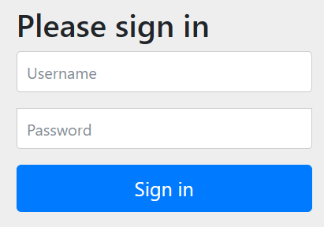

# .class

获取类的class对象

```java
SpringApplication.run(MaidApplication.class, args);
```

# 数组初始化

```java
int[] arr = new int[]{1, 2, 3};
String[] arr1 = new String[]{"1", "2", "3"};
int[] arr2 = {1, 2, 3};
String[] arr3 = {"1", "2", "3"};
Student[] arr4 = new Student[]{new Student(), new Student()};
Student[] arr5 = {new Student(), new Student()};
```

# 自定义404返回信息

```properties
spring.mvc.throw-exception-if-no-handler-found=true
spring.web.resources.add-mappings=false
```

```java
@RestControllerAdvice
public class GlobalExceptionHandler {
  @ExceptionHandler(NoHandlerFoundException.class)
  public String noHandlerFoundException(NoHandlerFoundException e, HttpServletRequest request) {
    System.out.println(e);
    System.out.println(request);
    return "胜多负少";
  }
}
```

# SimpleDateFormat

| yyyy：年                                           |
| -------------------------------------------------- |
| MM：月                                             |
| dd：日                                             |
| hh：12小时制(0-11)                                 |
| HH：24小时制(0-23)                                 |
| mm：分                                             |
| ss：秒                                             |
| S：毫秒                                            |
| E：星期几                                          |
| D：一年中的第几天                                  |
| F：一月中的第几个星期(会把这个月总共过的天数除以7) |
| w：一年中的第几个星期                              |
| W：一月中的第几星期(会根据实际情况来算)            |
| a：上下午标识                                      |
| k：和HH差不多，表示一天24小时制(1-24)。            |
| K：和hh差不多，表示一天12小时制(0-11)。            |
| z：表示时区                                        |

```java
Date d = new Date();
System.out.println(d);
// 要转换的格式
SimpleDateFormat sdf = new SimpleDateFormat("yyyy-MM-dd HH:mm:ss SSS");
SimpleDateFormat sdf1 = new SimpleDateFormat(
  "一年中的第 D 天 一年中第w个星期 一月中第W个星期 E a 在一天中K时 z时区");
// 格式化日期，日期->字符串
String formatDate = sdf.format(d);
String formatDate1 = sdf1.format(d);
System.out.println(formatDate);
System.out.println(formatDate1);

String s = "2022-07-13 15:12:34 000";
try {
  Date date = sdf.parse(s);//格式化日期，字符串->日期
  System.out.println(date);
} catch (ParseException e) {
  e.printStackTrace();
}

```

# idea快捷键

| 快捷键         | 作用                               |
| -------------- | ---------------------------------- |
| ctrl + enter   | 自动补全变量名                     |
| sout           | System.out.print()                 |
| ctrl + o       | 实现接口的方法，或者覆盖父类的方法 |
| ctrl + enter   | 自动补全变量名                     |
| ctrl + alt + t | try-catch快捷键                    |
|                |                                    |
|                |                                    |
|                |                                    |
|                |                                    |

 

# javax

java和javax都是Java的API(Application Programming Interface)包，java是核心包，javax的x是extension的意思，也就是扩展包。java类库是java发布之初就确定了的基础库，而javax类库则是在上面增加的一层东西，就是为了保持版本兼容要保存原来的，但有些东西有了更好的解决方案，所以，就加上些，典型的就是awt(Abstract Windowing ToolKit) 和swing。

# 注解

## @WebServlet

```java
import javax.servlet.annotation.WebServlet;
```

```xml
<dependency>
  <groupId>javax.servlet</groupId>
  <artifactId>javax.servlet-api</artifactId>
  <version>3.0.1</version>
  <scope>provided</scope>
</dependency>
```


## @RestControllerAdvice

```java
import org.springframework.web.bind.annotation.RestControllerAdvice;
```

```java
@RestControllerAdvice
public class ControllerAdviceHandler {}
```

@RestControllerAdvice 是 Spring Framework 中的一个注解，用于定义一个全局的异常处理类，它可以捕获 Controller 层抛出的异常并进行统一的处理。

具体来说，当 Controller 层中的某个方法抛出异常时，Spring MVC 会在全局范围内查找一个 @RestControllerAdvice 注解标注的类，并调用其中的方法来处理该异常。这样可以避免在每个 Controller 方法中都编写相同的异常处理逻辑，减少代码冗余和提高代码复用性。

@RestControllerAdvice 注解常常与 @ExceptionHandler 注解一起使用，用于定义异常处理方法。@ExceptionHandler 注解可以指定要处理的异常类型，当 Controller 层抛出该类型异常时，会调用该方法来处理异常。

除了异常处理，@RestControllerAdvice 注解还可以用于其他方面，比如处理参数校验失败等情况。

## @ExceptionHandler

```java
import org.springframework.web.bind.annotation.ExceptionHandler;
```

```java
@ExceptionHandler(value = Exception.class)
public Result<?> errorHandler(Exception e) {
  return Result.fail(SYSTEM_ERROR.getCode(), SYSTEM_ERROR.getDesc());
}
```


@ExceptionHandler 注解是 Spring Framework 中的一个注解，用于指定异常处理方法。

具体来说，当 Controller 层中的某个方法抛出指定类型的异常时，Spring MVC 会自动调用使用 @ExceptionHandler 注解标注的方法来处理该异常。这样可以将异常处理逻辑从 Controller 方法中抽离出来，提高代码的可读性和可维护性。

@ExceptionHandler 注解可以指定要处理的异常类型，也可以使用默认的 Exception 类型来处理所有未被其他异常处理方法覆盖的异常。通常情况下，建议针对不同类型的异常编写不同的异常处理方法，以便更细粒度地处理异常。

@ExceptionHandler 注解可以在任何 Spring MVC 控制器中使用，包括 @Controller 和 @RestController。除了用于异常处理，@ExceptionHandler 注解还可以用于其他方面，比如处理请求参数校验失败等情况。

# IO流

IO流分字节流和字符流，字节流适合读写文件、二进制数据等；字符流适合读写文本文件

## 字节流

字节流基类（抽象类）：

- 输入流：InputStream，把数据从文件读到内存
- 输出流：OutputStream，把内存里的数据写入到文件

InputStream常用子类

- FileInputStream 

OutputStream常用子类

- FileOutputStream 

## 字符流

字节流基类（抽象类）：

- 输入流：Reader，把数据从文件读到内存
- 输出流：Write，把内存里的数据写入到文件


# 字符串

## StringBuffer和StringBuilder的区别

StringBuffer：可变字符串、效率低、线程安全；

StringBuilder：可变字符序列、效率高、线程不安全；


# Spring Security

pom坐标

```xml
<parent>
  <groupId>org.springframework.boot</groupId>
  <artifactId>spring-boot-starter-parent</artifactId>
  <version>3.0.4</version>
  <relativePath/> <!-- lookup parent from repository -->
</parent>
```

```xml
<dependency>
  <groupId>org.springframework.boot</groupId>
  <artifactId>spring-boot-starter-security</artifactId>
</dependency>
```

1、为什么要用spring security

因为默认情况下controller里的接口是不受保护的，任何人都可以访问。

如果要做登录限制，或者限制某些接口只有有权限的人才可以访问，要添加拦截器，在拦截器里写登录检查逻辑。

而spring security就帮我们做了这些工作。


2、添加spring security

当spring security被添加到pom依赖后，无需做任何配置，启动项目，访问任意controller接口，发现会跳转到一个登录页面。



这个页面是spring security集成的。账号默认是user，密码在项目启动时打印在控制台


> Using generated security password: 9c6634d2-8b15-40aa-bb8a-ee062316e559

表单会提交到/login，/login是spring security内部接口。

登录后再次访问controller里的接口，发现可以访问了。


# mysql

## jdbc驱动

mysql的jdbc驱动（mysql-connector-java是老版本的驱动名称）

```xml
<dependency>
  <groupId>com.mysql</groupId>
  <artifactId>mysql-connector-j</artifactId>
  <scope>runtime</scope>
</dependency>
```

在springboot3.0.4版本中，mysql-connector-j的版本为8.0.32

```xml
<mysql.version>8.0.32</mysql.version>
```

## 连接池

springboot3.0.4默认采用的连接池是HikariCP

```xml
<hikaricp.version>5.0.1</hikaricp.version>
```

```xml
<dependency>
  <groupId>com.zaxxer</groupId>
  <artifactId>HikariCP</artifactId>
  <scope>runtime</scope>
</dependency>
```

## spring.datasource

```yaml
spring:
  datasource:
      type: com.zaxxer.hikari.HikariDataSource
      #高版本 Mysql 驱动时，配置的 driver-class-name 不再是 com.mysql.jdbc.Driver，url 后面必须设置时区 serverTimezone
      driver-class-name: com.mysql.cj.jdbc.Driver
      url: jdbc:mysql://localhost:3306/dbys?serverTimezone=UTC&characterEncoding=utf8
      username: root
      password: mrc1025
```

- type：指定使用哪个连接池
- url：`jdbc:mysql`(协议)，`localhost`(ip)，`3306`(端口)，时区：serverTimezone=UTC，编码：characterEncoding=utf8


# maven


# 依赖范围scope

```xml
<dependency>
	<groupId>junit</groupId>
	<artifactId>junit</artifactId>
	<version>4.7</version>
  <scope>test</scope>
</dependency>
```

scope标签用于指定依赖范围，可选值有：

- compile：默认值。打包时会包含这个依赖。
- test：测试时用到，打包时不会包含这个依赖。
- provided：编译和测试时有效，运行时无效，典型的例子是servlet-api，只在开发时需要，打包后容器已经提供。打包时不会包含这个依赖。
- runtime：只在运行项目时需要用到，不参与编译。打包时会包含这个依赖。
- system
- import
