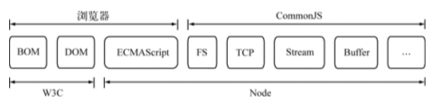
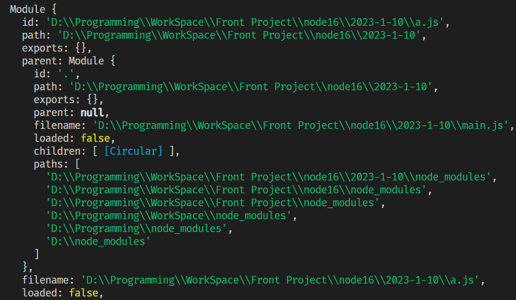

# CommonJS



## 模块

一个文件就是一个模块。

模块的五虎上将：exports、require、module、`__filename`、`__dirname`，每个模块都具有这五个属性或方法

- module

  module对象代表模块自身，module.exports对象用来挂载要导出的方法、变量、类等

  ```js
  // a.js
  console.log(module);
  ```

  

- __dirname

  `__dirname`当前文件所在的目录

  ```js
  // main.js
  console.log(__dirname);
  // D:\Programming\WorkSpace\Front Project\node16\2023-1-10
  ```

  

- __filename

  `__filename`当前文件的名称(包含路径)

  ```js
  // main.js
  console.log(__filename);
  // D:\Programming\WorkSpace\Front Project\node16\2023-1-10\main.js
  ```


## exports

```javascript
// a.js
const a = 1
const b = (c) => { return c * 2 }
```

方式一（单个挂载）

```js
module.exports.a = a
module.exports.b = a
```

方式二（批量挂载）

```js
module.exports = {
  a,
  b
}
```

方式三(语法糖)，使用exports来简化导出（exports是module.exports的一个对象引用，不可以对它赋值）

```js
exports.a = a
exports.b = a
```

注意，千万不能直接给exports赋值，对引用赋值，会导致exports不再指向module.exports

```js
// 错误的，exports不再有导出的作用了
exports = a

// 正确写法
module.exports = a
```

## require

使用require加载指定模块的exports对象，同一个项目下的文件必须要写路径，如果不写会到node_modules下去找

```js
// b.js
const moduleA = require('./a.js') // .js可以省略
// const moduleA = require('./a')
```

require方法返回这个模块的exports对象，所以moduleA指向的是a.js的module.exports

```js
// moduleA => a.js module.exports
moduleA.a
// 1
moduleA.b(2)
// 4
```

解构写法，因为module.exports是一个对象，所以可以用对象解构语法

```javascript
const { a, b } = require('./a')
```


