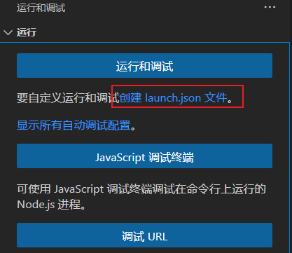

# typescript

ts官网：[TypeScript: JavaScript With Syntax For Types. (typescriptlang.org)](https://www.typescriptlang.org/zh/)

## 安装ts

```sh
npm i typescript -g
```

## 查看ts版本

```sh
tsc -v
```

> Version 4.8.4

# tsconfig.json

生成tscofnig.json

```sh
tsc --init
```

## target

```json
"target": "es2018"
```

默认：target: es2016

设置js版本。例如promise finally语法至少需要es2018版本

## module

```json
"module": "ES6"
```

模块标准：es模块或者CommonJS模块

## moduleResolution

```json
"moduleResolution": "classic"
```

生成的js，在引入其他js的时候自动添加.js后缀

```js
// import { tokenize } from './tokenize'
import { tokenize } from './tokenize.js'
```

这个选项有时候会不起作用，解决办法是导入ts文件时，添加`.js`后缀名

```typescript
// 导入index.ts
import calc from './calc.js'
```

## sourceMap

```json
"sourceMap": true
```

额外生成一个xxx.js.map文件，用于调试

## outDir

```json
"outDir": "src/js"
```

指定生成js的目录

# ts-node

全局安装ts-node

```sh
npm i -g ts-node
```

直接在Node.js执行ts文件

```sh
ts-node main.ts
```

ts-node在内部先将ts编译成js，然后再执行js

# vscode调试ts

1、创建launch.json，选择Node.js



2、添加ts-node

```json
"runtimeArgs": ["-r", "ts-node/register"],
```

在configurations下添加

```json
{
  // 使用 IntelliSense 了解相关属性。 
  // 悬停以查看现有属性的描述。
  // 欲了解更多信息，请访问: https://go.microsoft.com/fwlink/?linkid=830387
  "version": "0.2.0",
  "configurations": [
    {
      "type": "node",
      "request": "launch",
      "name": "启动程序",
      "skipFiles": [
        "<node_internals>/**"
      ],
      "runtimeArgs": ["-r", "ts-node/register"],
      "program": "${workspaceFolder}\\ast.ts",
    }
  ]
}
```

3、设置入口文件program

```json
"program": "${workspaceFolder}\\ast.ts"
```

4、安装ts-node和typescript

```sh
npm init -y
npm i ts-node
npm i typescript
```

全局安装的在调试环境下不能用，必须安装到项目里

# ts -> js

## 手动编译

```sh
tsc index.ts
```

> index.js

## 自动编译

vscode菜单栏`终端`->`运行任务...`->`typescript`->`tsc:监视-tsconfig.json`

设置js输出目录

```json
"outDir": "src/js"
```

> src/js
>
> ​	index.js
>
> ​	main.js