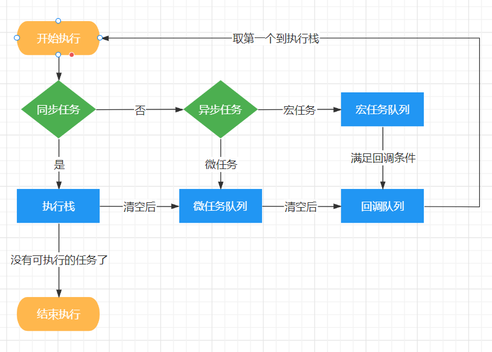

# 错误与异常

```javascript
try {
	window.someNonexistentFunction();
} catch (error) {
  const { name, message, stack } = error
  console.log(name, message, stack);
}
```

catch的error参数是一个对象,typeof error = 'object'，有3个属性，name：异常类型，如TypeError；message：异常信息；stack：异常所在的堆栈(代码在哪行出错的)

# inner offset scroll client

inner系列只有window具有，而offset、scroll、client系列只有Element类型的dom节点具有

## window

- window.screenLeft 浏览器距离屏幕左侧的距离（兼容window.screenX）
- window.screenTop 浏览器距离屏幕上方的距离（兼容window.screenY）
- window.innerWidth 浏览器可视区域宽度，包含滚动条。（只计算在滚动区域里能看到部分的宽度，溢出隐藏的部分不计算，非文档整体宽度）
- window.innerHeight 浏览器可视区域高度， 包含滚动条。（只计算在滚动区域里能看到部分的高度，溢出隐藏的部分不计算，非文档整体高度）

## screen

- screen.width 屏幕的宽度（div宽度定义为屏幕的宽度是正好没有滚动条的）
- screen.height 屏幕的高度（div高度定义为屏幕的高度是有滚动条的，因为浏览器有标签栏、地址栏等占用一部分屏幕高度）

## element

只适用于Element类型，例如document.documentElement或任意一个dom节点，（window上不具有这些属性）

- element.clientWidth 内容宽度+padding，不包含滚动条（滚动条会挤占一部分内容宽度）
- element.clientHeight 内容高度+padding，不包含滚动条（滚动条会挤占一部分内容宽度）
- element.clientLeft 元素左边框的宽度（非距离浏览器左侧的距离）
- element.clientTop 元素上边框的高度（非距离浏览器上方的距离）

- element.offsetWidth 内容宽度+padding+边框，不包含滚动条（相比client多了边框）
- element.offsetHeight 内容高度+padding+边框，不包含滚动条

- element.offsetTop 元素相对于最近的定位祖先元素的距离（没有最近的定位祖先元素，就相对于body）
- element.offsetHeight 元素相对于最近的定位祖先元素的距离（没有最近的定位祖先元素，就相对于body）
- element.scrollWidth 计算具有滚动条时的实际宽度，实际内容宽度+padding
- element.scrollheigth 计算具有滚动条时的实际高度，实际内容高度+padding
- element.scrollTop 垂直滚动条滚动距离（window不具有此属性）
- element.scrollLeft 水平滚动条滚动距离（window不具有此属性）


# window专属事件

- resize 监听浏览器窗口大小改变事件
- scroll 监听滚动条事件（也可以监听document.documentElement的scroll事件）

# 事件循环

`JS`是单线程的，为了防止一个函数执行时间过长阻塞后面的代码，

- 所以会先将同步代码压入执行栈中，依次执行。
- 将异步代码推入异步队列，异步队列又分为宏任务队列和微任务队列，因为宏任务队列的执行时间较长，所以微任务队列要优先于宏任务队列。

| 异步代码 | 执行时间 | 优先级 | 代表                             |
| -------- | -------- | ------ | -------------------------------- |
| 宏任务   | 长       | 低     | `setTimeout` `setInterval`       |
| 微任务   | 短       | 高     | `Promise.then` `MutationObserver` |

JS运行的环境。一般为浏览器或者Node。 在浏览器环境中，有JS 引擎线程和渲染线程，且两个线程互斥。 Node环境中，只有JS 线程。 不同环境执行机制有差异，不同任务进入不同Event Queue队列。 当主程结束，先执行准备好微任务，然后再执行准备好的宏任务，一个轮询结束。

#### **浏览器中的事件循环（Event Loop)**

事件环的运行机制是，先会执行栈中的内容，栈中的内容执行后执行微任务，微任务清空后再执行宏任务，先取出一个宏任务，再去执行微任务，然后在取宏任务清微任务这样不停的循环。

执行栈 => 微任务队列 => 取回调队列第一个回执行栈=>执行栈=>微任务=>取回调队列第一个回执行栈=>执行栈



- eventLoop 是由JS的宿主环境（浏览器）来实现的；
  
- 事件循环可以简单的描述为以下四个步骤:
  
    1. 函数入栈，当Stack中执行到异步任务的时候，就将他丢给WebAPIs,接着执行同步任务,直到Stack为空；
    2. 此期间WebAPIs完成这个事件，把回调函数放入队列中等待执行（微任务放到微任务队列，宏任务放到宏任务队列）
    3. 执行栈为空时，Event Loop把微任务队列执行清空；
    4. 微任务队列清空后，进入宏任务队列，取队列的第一项任务放入Stack(栈）中执行，执行完成后，查看微任务队列是否有任务，有的话，清空微任务队列。重复4，继续从宏任务中取任务执行，执行完成之后，继续清空微任务，如此反复循环，直至清空所有的任务。
    
    
    
- 浏览器中的任务源(task):
  
    - `宏任务(macrotask)`：  
        宿主环境提供的，比如浏览器  
        ajax、setTimeout、setInterval、setTmmediate(只兼容ie)、script、requestAnimationFrame、messageChannel、UI渲染、一些浏览器api
    - `微任务(microtask)`：  
        语言本身提供的，比如promise.then  
        then、queueMicrotask(基于then)、mutationObserver(浏览器提供)、messageChannel 、mutationObersve

传送门 ☞ [# 宏任务和微任务](https://juejin.cn/post/7001881781125251086 "https://juejin.cn/post/7001881781125251086")

### setTimeout、Promise、Async/Await 的区别

1. setTimeout
   
    settimeout的回调函数放到宏任务队列里，等到执行栈清空以后执行。
    
2. Promise
   
    Promise本身是**同步的立即执行函数**， 当在executor中执行resolve或者reject的时候, 此时是异步操作， 会先执行then/catch等，当主栈完成后，才会去调用resolve/reject中存放的方法执行。
    
    
    
    ```javascript
    console.log('script start') 
    let promise1 = new Promise(function (resolve) {     
      console.log('promise1')     
      resolve()     
      console.log('promise1 end') 
    }).then(function () {     
      console.log('promise2') 
    }) 
    setTimeout(function(){     
      console.log('settimeout') 
    }) 
    console.log('script end') 
    // 输出顺序: script start->promise1->promise1 end->script end->promise2->settimeout
    ```
    
3. async/await
   
    async 函数返回一个 Promise 对象，当函数执行的时候，一旦遇到 await 就会先返回，等到触发的异步操作完成，再执行函数体内后面的语句。可以理解为，是让出了线程，跳出了 async 函数体。
    

    ```javascript
    async function async1(){    
      console.log('async1 start');    
      await async2();     
      console.log('async1 end') 
    } 
    async function async2(){     
      console.log('async2') 
    } 
    console.log('script start'); 
    async1(); 
    console.log('script end') 
    // 输出顺序：script start->async1 start->async2->script end->async1 end```
    

